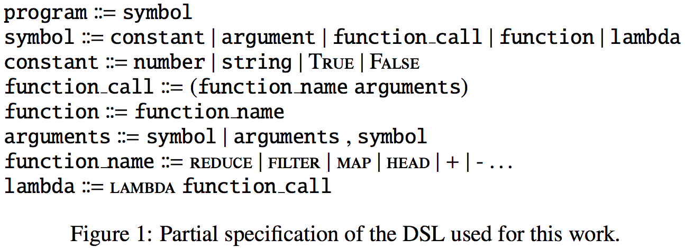
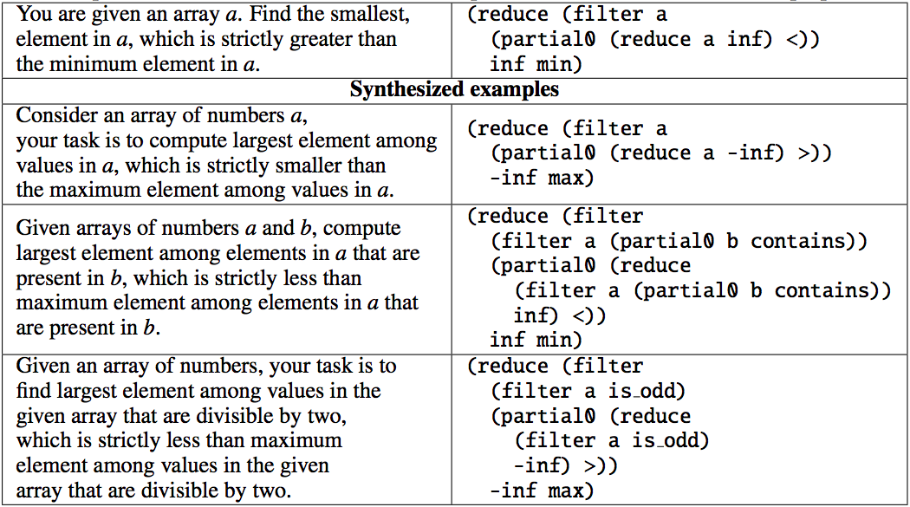
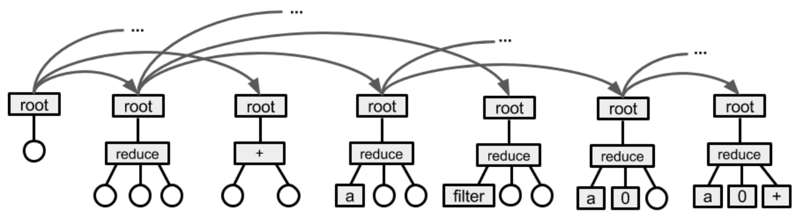
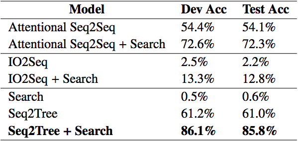
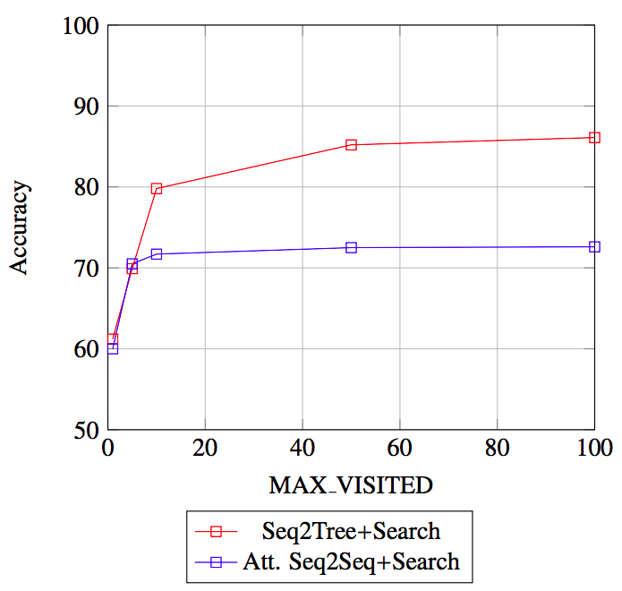

Hi everybody,

In this blog post we will outline some of our recent work on using neural networks and search techniques to synthesize programs from natural language spec and few examples from [our paper](https://arxiv.org/abs/1802.04335).

Code synthesis is a rather old field of research, that has been active since long before the deep learning took off. Because of that historically many code synthesis labs were concentrated on techniques that do not involve neural networks. For example, one of the most known successed of program synthesis to date FlashFill [1] uses search in a space of all programs in a restricted domain specific language using lots of hand crafted heuristics, no neural networks involved (this changed recently with RobustFill [2] and other recent work).

Since until the emergence of deep recurrent neural networks and attention mechanism natural language understanding was not working particularly great (and arguably it still isn't), majority of advances in code synthesis until recently were based on input / output pairs as the specification of the desired program. While applicable in some cases (like the above mentioned FlashFill), generally it is desirable to be able to provide the specification in a form of a natural language request instead.

With natural language specifications come some challenges. First of all, natural language is very ambiguous. If you think about how we communicate what we want to engineers today, we rarely give them a task and walk away. More often than not we get engaged into a conversation, in which details of what we want are gradually figured out. If we are to build a system that synthesizes programs from natural language specification, we would need to somehow account for that -- either by making sure the specifications we provide in our training set are absolutely unambiguous, or by providing some way to the network to disambiguate between different understandings.

Another major challenge is that in modern world the only real way to work with natural language is deep neural networks. Deep neural networks, however, are actually a pretty bad choice if we are looking for some model to produce code, at least in one-token-at-a-time manner. The reason is that deep nets are intrinsically probabilistic, meaning that if they are used to produce a program one token at a time, at each step there would be a small chance of producing an incorrect token. Errors compound very fast, and even for moderately long programs and very good model the chance of messing up at least one token are very high. In natural language translation this is not a big issue -- couple words in a reverse order, or a slightly misused word generally can be tolerated. In code synthesis one misused token would result in a completely wrong program. This is where traditional code synthesis techniques, such as search, have a big advantage.

In this work we explore a possible combination of the two techniques. In particular, we first train a neural sequence to sequence neural network that reads a natural language description of a problem and outputs a program that solves it one token at time, and measure its accuracy. We then see how much we can improve upon the results by running search in the space of valid programs guided by this neural network instead of using the network directly to synthesize code.

<!--more-->

### Dataset

We started by preparing a dataset to run our experiments on. For that we first came up with a domain specific functional language inspired by LISP. The language has functions such as reduce, map and filter, a library of functions that operate on integers and strings such as addition and concatenation, and lambdas that can call themselves recursively. While we do not prove explicitly that this language is Turing complete, a very large set of possible programs can be expressed in it.

Having the DSL in place, we come up with ~50 basic problems, such as “given an array of numbers, find all the numbers in it that are prime”. For each such problem we parametrize it, e.g. “given an array of numbers, find all the numbers in it that are {odd|even|prime|divisible by three|positive|negative}”, and added some paraphrasing. We then stack these problems together, e.g. given the problem from the previous paragraph and another problem “given an array of numbers, sort it” we would combine them to get, among others, the following problem: “given an array of numbers, return sorted list of all the odd numbers in it”. By applying these three techniques (parametrization, paraphrasing and combination) to our original set of 30 problems we got a dataset of ~100k problems, each problem comprising a statement, a solution and few input/output pairs. We split these problems into training, development and test set by making sure that the same combination of original problems never occurs in two sets. I.e. the particular combination of “filter out even numbers” and “sort array” might occur only in one of the training, dev and test set.

Training model that solves such problems would not mean it actually figures out how to solve the original 30 tasks. Since there’s only 30 of them, it will most certainly overfit to them. However, it would imply that it learned how to combine these tasks, which on itself is an important step towards general purpose code synthesis.

We train two different models, one is vanilla Seq2Seq with attention, and another is more sophisticated Seq2Tree with attention (shown in the beginning of the post). The latter performs slightly better than the former (61% vs 54% accuracy). Additionally we built a IO2Seq model (similar to RobustFill[2]), where it only sees 3 input-output examples as input, encoded with byte encoder. As seen in table below, going only from input-output examples doesn't really perform in this task.

In the second set of experiments we run pure search, in which the AST tree of the program is brute-forced one token at a time, for each node enumerating over all possible functions or constants that match the expected type of that node. This approach completely ignores the statement of the problem, and uses the input / output pairs to verify if the found program is correct or not. Such search, without further heuristics, can’t perform well, because in principle it has to iterate over number of programs comparable to the total number of possible programs with the same number of tokens, and that number grows exponentially. This is confirmed by our experiments, with accuracy of only 0.5%. The accuracy is measured by counting for how many problems search found a correct program among the first 100 programs it finds (the few it does find are for very simple programs such as `(+ a b)`).

The last set of experiments involves using the same search, but at every step the set of nodes it considers is guided by either seq2seq or seq2tree model trained in the first set of experiments. We would again only look at the first 100 programs that the search finds, and verify all of them on the input / output examples. In this last set of experiments we get 85% accuracy.

This confirms our original hypothesis that the deep network, even if very close to the correct solution, is very likely to make an error that would make the solution completely wrong. While in 85% of cases the network was sufficiently close for the correct program to be within first 100 most likely trees it would have synthesized, only in 2/3 of those cases that program was the most likely one.

For more details on implementation and results, check out the [paper on Arxiv](https://arxiv.org/abs/1802.04335).

_Illia Polosukhin and Alex Skidanov_

## References

[1] Sumit Gulwani, William R. Harris, and Rishabh Singh. Spreadsheet data manipulation using examples. Commun. ACM, 55:97–105, 2012

[2] Jacob Devlin, Jonathan Uesato, Surya Bhupatiraju, Rishabh Singh, Abdel-rahman Mohamed, Pushmeet Kohli. RobustFill: Neural Program Learning under Noisy I/O, ICML 2017