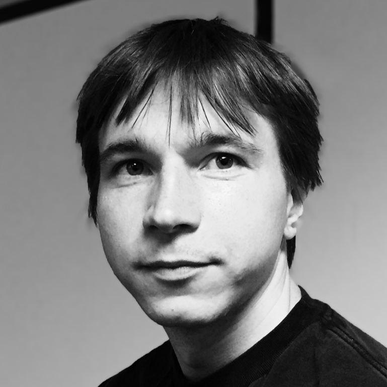
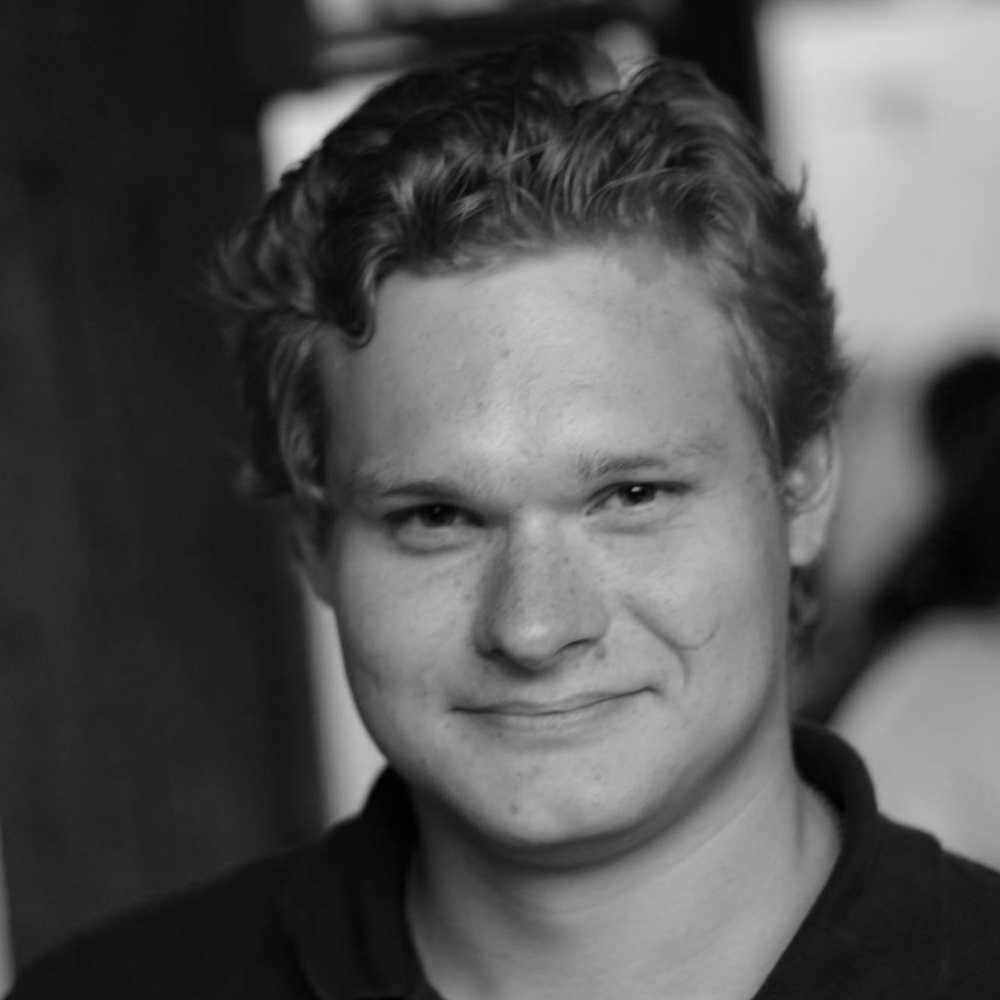

<section class="text-center">
  

    <h2 class="section-heading">Our mission is to give power of programming to everyone.</h2>
    

    
We belive that programming should be as easy as talking to the computer.
    And we belive this will unlock advances in all areas of humanity.

    
Imagine how much faster can cancer research go, if the domain experts instead of having meetings with engineers could just directly ask computer to analyze required data streams.
    Businesses won't need to wait for a crucial feature in the third-party SaaS while doing something manually.
    In the future they will be able to quickly build their own solution tailored to their needs.

    
"Software is eating the world" said Marc Andreessen, and we on the mission to give the power of this transformation to everyone.

  

  

    

      

        <h2 class="section-heading">Team </h2>
        

      

    

  

 

    

        

        
        

        

            
Alex Skidanov, CEO, co-founder

            
Previously Director of Engineering at MemSQL, ex-Microsoft.

        

    

    

        

            
        

        

            
Illia Polosukhin, CTO, co-founder

            
Previously Engineering Manager at Google Research, Natural Language Researcher, major TensorFlow contributor.

        

    

 

</section>

